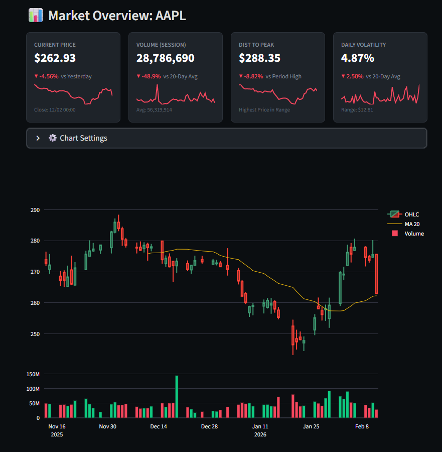
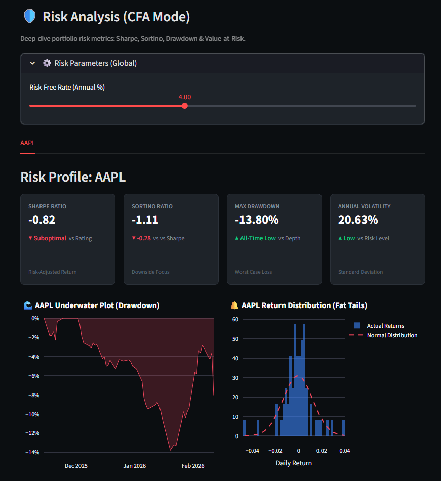
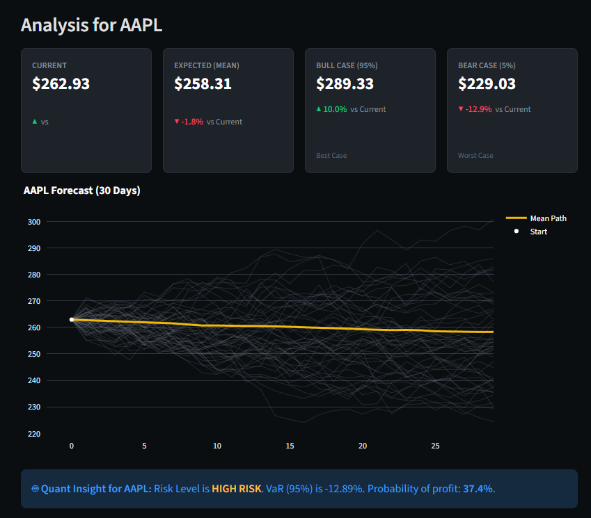
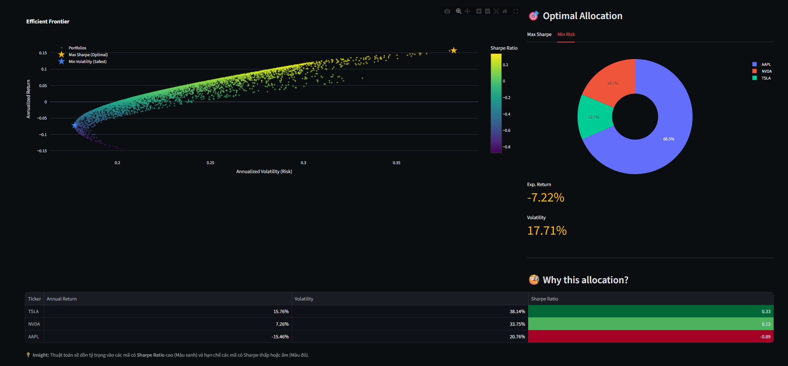

# ⚡ AlphaQuant - Quantitative Investment Research Terminal


## 📖 Overview

**AlphaQuant** is a professional-grade quantitative analytics dashboard designed to empower investors and data analysts with institutional-level insights.

Moving beyond simple price tracking, AlphaQuant leverages advanced statistical models—including **Monte Carlo Simulations** and **Modern Portfolio Theory (MPT)**—to assess risk, forecast future price paths, and construct optimized portfolios. The platform bridges the gap between raw market data and actionable financial strategies using a clean, interactive interface.

---

## 🚀 Key Features

### 1. 📈 Market Overview & Multi-Asset Comparison
Real-time technical analysis engine supporting Stocks, ETFs, and Cryptocurrencies.
* **Dynamic Watchlist:** "Search & Add" functionality for seamless multi-asset tracking.
* **Performance Comparison:** Normalized relative performance charts to compare different asset classes (e.g., Bitcoin vs. Apple).
* **Technical Indicators:** Interactive candlestick charts with SMA, EMA, and Bollinger Bands.

### 2. 🛡️ Risk Analysis (CFA Standards)
Deep-dive into the risk profile of any asset using industry-standard metrics.
* **Advanced Metrics:** Automated calculation of **Sharpe Ratio**, **Sortino Ratio**, and **Annualized Volatility**.
* **Drawdown Analysis:** "Underwater Plots" to visualize historical drawdown depth and recovery duration.
* **Distribution Analysis:** Skewness & Kurtosis detection to identify **"Fat Tail" risks** (Black Swan events) often missed by normal distribution models.

### 3. 🎲 AI Forecast & Stochastic Modeling
Probabilistic forecasting engine using **Geometric Brownian Motion (GBM)**.
* **Monte Carlo Simulation:** Generates 1,000+ potential future price paths based on historical drift and volatility.
* **Value at Risk (VaR):** Quantifies downside risk (VaR 95%) and Expected Shortfall (CVaR).
* **Quant Insights:** Provides actionable strategic advice on probability of profit and recommended leverage sizing based on the **Kelly Criterion**.

### 4. 💼 Portfolio Optimization
Construct the mathematically optimal portfolio using **Markowitz Efficient Frontier**.
* **Efficient Frontier Visualization:** Visualizes the risk-return trade-off of 5,000+ simulated portfolio combinations.
* **Optimal Allocation:** Automatically solves for:
    * **Max Sharpe Ratio Portfolio** (The "Tangency Portfolio" for best risk-adjusted return).
    * **Minimum Volatility Portfolio** (The safest possible allocation).

---

## 📸 Screenshots

### 📊 Dashboard & Comparison
*Real-time tracking of multiple assets with relative performance metrics.*


### 🌊 Risk Analysis (Underwater Plot)
*Visualizing drawdown periods and recovery times.*


### 🎲 Monte Carlo Simulation
*Stochastic modeling of future price paths with confidence intervals.*


### 🎯 Efficient Frontier Optimization
*Finding the optimal asset allocation using Modern Portfolio Theory.*


---

## 🛠️ Tech Stack

* **Core:** Python 3.10+
* **Frontend:** Streamlit
* **Data Processing:** Pandas, NumPy
* **Financial Data:** Yfinance (Yahoo Finance API)
* **Visualization:** Plotly (Interactive Charts)
* **Statistical Modeling:** SciPy (Optimization), Statsmodels

## 📂 Project Structure

```text
AlphaQuant/
├── src/
│   ├── __init__.py
│   ├── data_loader.py       # Data fetching & caching logic
│   ├── quant_engine.py      # Core math (Monte Carlo, Sharpe, Markowitz)
│   ├── utils.py             # UI helpers (Cards, Sparklines)
│   └── views/               # UI Components
│       ├── dashboard.py     # Market Overview Tab
│       ├── risk.py          # Risk Analysis Tab
│       ├── ai_forecast.py   # Monte Carlo & VaR Tab
│       └── portfolio.py     # Portfolio Optimization Tab
├── app.py                   # Main Application Entry Point
├── requirements.txt         # Project Dependencies
└── README.md                # Documentation
